# revio · Architecture

> Design document — built for PPT extraction. Every header here is a slide title;
> every diagram is Mermaid (renders directly in GitHub, Cursor, Obsidian, or via
> `mmdc` to PNG for slides).

---

## 1. One-paragraph summary

revio is an **agentic code review CLI** built on LangGraph. It combines six
deterministic static analyzers with LLM reasoning across 17 language profiles
(JS / TS / Python / Rust / Java / Go / C/C++ / PLC + 10 more) and lets the
agent call user-defined RAG, Skills, and external MCP servers. It produces
findings with hypothesis-evidence chains, drops hallucinated findings via a
grounding validator, and (in dedup mode) applies code-modification patches
to real files with git-stash safety nets.

**Bottom line**: not "another LLM that reads code" — a layered system where
the LLM is the orchestrator above 13 deterministic analyzers, 18 Tree-sitter
grammars, RAG, and ~30 specialized tools.

---

## 2. The 4-layer architecture

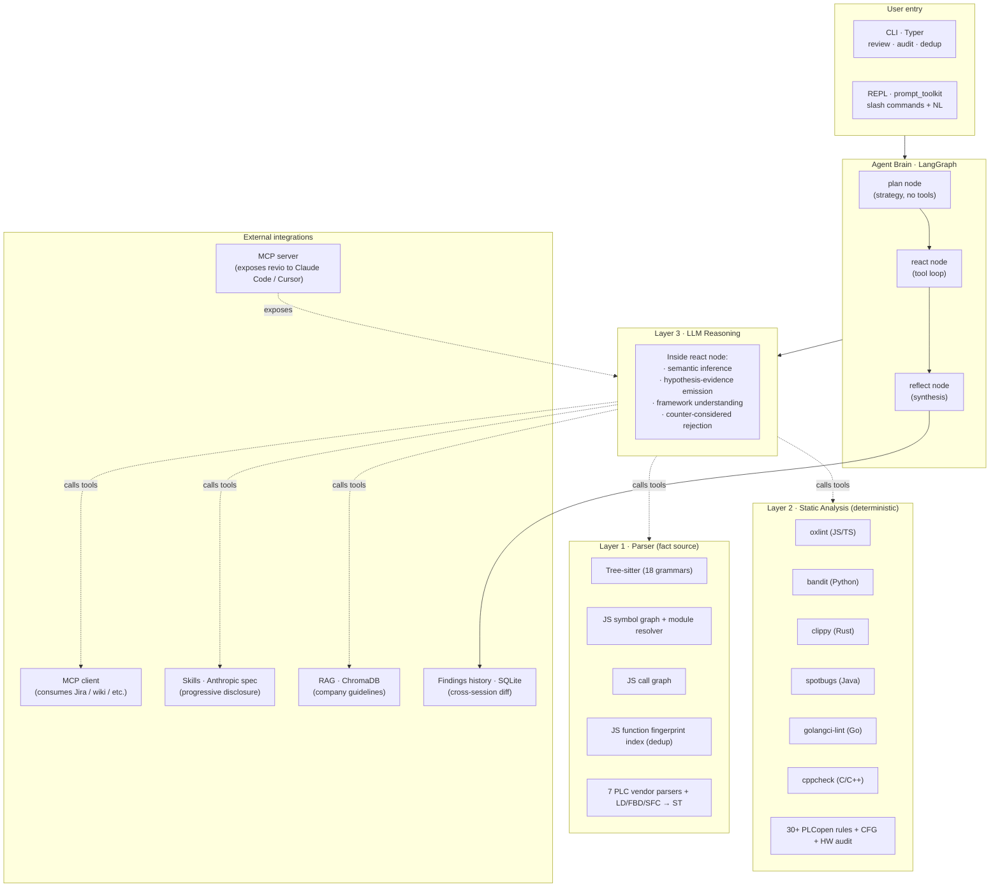

Each layer's job is single-sentence:

| Layer | Output | Why this layer |
|---|---|---|
| **1 · Parser** | "What's in this code" — structural facts | LLM doesn't have to re-derive the AST |
| **2 · Static** | "What's deterministically wrong" — rule violations | Zero hallucination, sub-second results |
| **3 · LLM** | "What's semantically wrong" — judgment calls | The only layer that can read between lines |
| **External** | "What's contextual" — RAG / Skills / MCP / history | Customer-specific knowledge |

**The agent (LangGraph) sits on top and decides which tool to call when.**
Layer 3 is the LLM doing the orchestration; Layers 1-2 + RAG/Skills/MCP/history
are the data sources it pulls from on demand.

---

## 3. Highlight #1 — AST does NOT blow up the LLM context window

**The naive approach** (what most "LLM code review" tools do):

```
Read every file → dump into prompt → ask LLM
                                      └─ context window: 200K → 1M → OOM
```

A medium-size repo (~3000 LOC) easily blows past 200K tokens this way.

**revio's approach** — Tree-sitter as a *fact provider*, not a context dump:

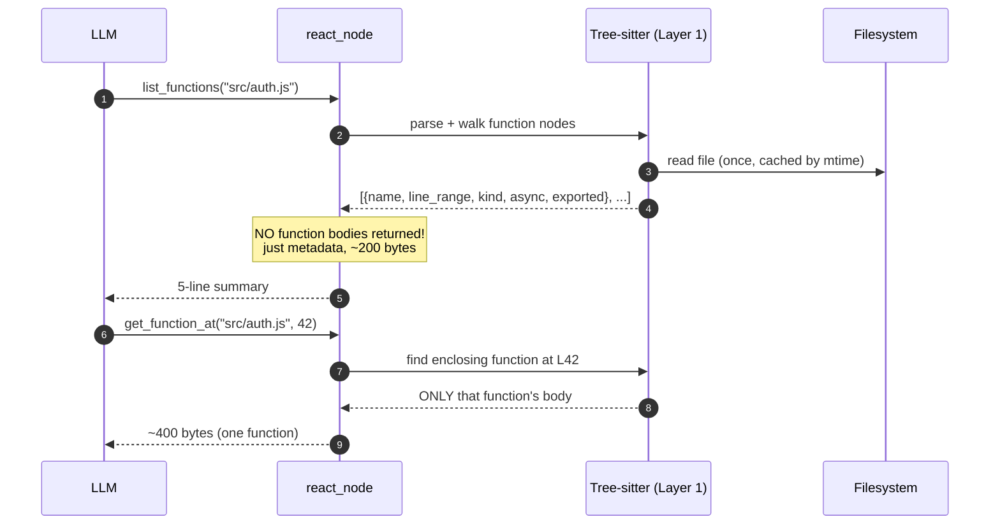

Concrete: a 50-function module returns:
- `list_functions` → ~2 KB metadata (line ranges + names)
- LLM looks at one suspicious function → `get_function_at` → ~400 bytes
- vs. dumping whole file (~50 KB)

**Result**: a typical audit of a 100-file codebase uses ~20K input tokens
(20-40 tool calls × 500 bytes), vs. ~500K+ for naive dump-all approaches.

> See `src/revio/layers/parser/treesitter_generic.py` for the implementation;
> the agent tools that surface this lazy view are in `src/revio/agent/generic_tools.py`.

---

## 4. Highlight #2 — Token efficiency: 5 deliberate design choices

| Design | Token saved | Cost |
|---|---|---|
| **AST-based on-demand context** (Highlight #1) | 95-99% on whole-file dump | Need Tree-sitter per language |
| **Layer 2 auto-emit**: static findings inject directly to state — LLM doesn't need to re-emit them via report_finding | ~30% of LLM output | Findings tagged `detected_by=static` |
| **Progressive disclosure for Skills**: plan stage shows catalog (name + 1 line each), LLM loads full body only when relevant | 80% of skill content avoided | Need `load_skill` tool |
| **Mode-specific tool whitelist**: `dedup` mode hides `run_oxlint` (style noise); `review` hides cross-repo dedup tools | ~15% per turn | Mode classifier needed |
| **Per-budget hard limit**: enforces `max_tool_calls` so a stuck agent can't burn through context indefinitely | Bounded worst-case | Budget tuning |

**Real measurement** (DeepSeek run on `tests/fixtures/multilang/python_sample/app.py`):

| | Value |
|---|---|
| Tool calls | 11 / 12 |
| Findings (LLM-emitted + auto-emit) | 12 (bandit 7 + LLM 5) |
| Wall time | 42.4 s |
| Estimated input tokens | ~25K |
| Estimated output tokens | ~5K |
| Cost (deepseek-chat) | ~$0.013 |

These numbers aren't estimated — they're read off every LLM response's
`usage_metadata` by `_TokenAccountant` in `agent/runner.py` and surfaced
in real time. See §17 below.

---

## 5. Highlight #3 — Static analysis layer (Layer 2) advantages

Most "LLM code review" tools have **no static layer at all** — they rely on
the LLM to spot every issue from raw source. That's where hallucination
and false positives come from.

revio wires 13 best-in-class analyzers, **one per major language**:

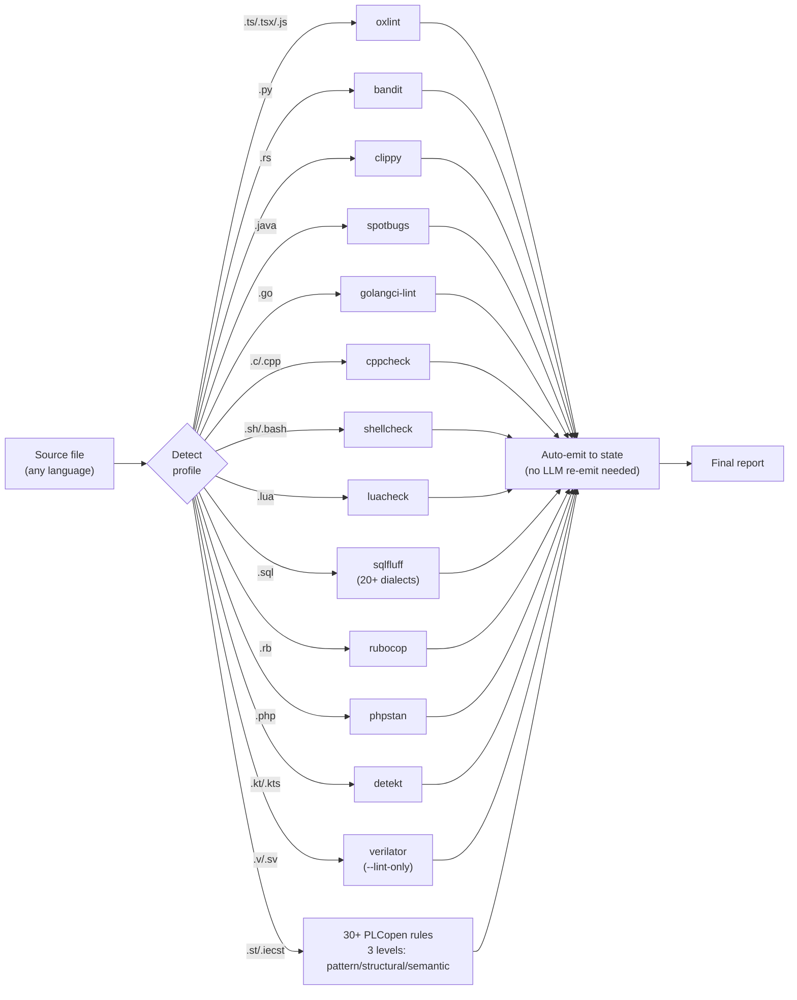

**Why each tool was chosen** (not arbitrary):

| Tool | Why it's *the* choice |
|---|---|
| **oxlint** | Rust-based; ~50× faster than ESLint; 500+ rules; production-grade |
| **bandit** | de-facto Python security analyzer; CWE-mapped; PyCQA-blessed |
| **clippy** | ships with Rust toolchain (`cargo clippy`); written by the language team |
| **spotbugs** | FindBugs successor; FindSecBugs plugin for OWASP coverage |
| **golangci-lint** | bundles 100+ Go linters with one config; the industry standard |
| **cppcheck** | BSD-licensed; ships in every package manager; catches the CWEs that matter (119/416/476/787) |
| **shellcheck** | 18k★ on GitHub; the only serious choice for bash/sh/zsh; rules cover word-splitting, quoting, $IFS pitfalls, exit-code masking |
| **luacheck** | Lua community standard; mature; single binary; catches global pollution, shadowing, control-flow issues |
| **sqlfluff** | only major SQL linter with dialect auto-detection (postgres / mysql / snowflake / bigquery / redshift / sqlite / ...); pip-installable |
| **rubocop** | Ruby community standard; style + perf + security cops in one tool; supports auto-fix |
| **phpstan** | level-based incremental adoption (0-9); finds type errors, dead code, deprecated API without running the code |
| **detekt** | the Kotlin lint standard (especially for Android & server-side Kotlin); style + complexity + potential bugs + naming conventions |
| **verilator** | the open-source SystemVerilog standard; `--lint-only` mode catches WIDTH mismatches, LATCH inference, BLKSEQ (blocking-in-sequential), MULTIDRIVEN nets, ASYNC paths — all synthesis-correctness issues that survive into silicon |

**Why "auto-emit"** (a real innovation): static analyzers are deterministic.
If we wait for the LLM to "see" their output and then call `report_finding`,
we're adding a layer of unreliability (the LLM can forget, drop, paraphrase
wrong). Instead: the tool pushes its findings *directly* into agent state
via `ctx.pending_findings`. LLM sees them, can add semantic context, but
they're already guaranteed to appear in the report.

> Layer 2 source: `src/revio/layers/static/{oxlint,bandit,clippy,spotbugs,golangci_lint,cppcheck,shellcheck,luacheck,sqlfluff,rubocop,phpstan,detekt,verilator,plc_rules,plc_cfg,plc_hw_config}.py`
> Auto-emit mechanism: `src/revio/agent/tool_context.py` (`pending_findings` field)
> + `src/revio/agent/graph.py` (drain after each tool call).

---

## 6. Highlight #4 — RAG over company-specific rules

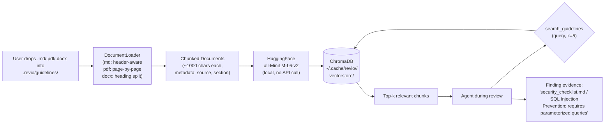

**Why this matters for the enterprise sales angle**:

| Without RAG | With RAG |
|---|---|
| "This looks like SQL injection" | "**Per `security_checklist.md` § 3.2** — parameterized queries are required for all DB ops. This usage at `auth.py:42` violates §3.2." |

Customer-specific knowledge is **the** unique value. GitHub Copilot Review,
Cursor, Codium etc. all have zero awareness of company-internal policies.
revio cites them directly in findings.

**Storage cost**: ChromaDB persistent at `~/.cache/revio/<hash>/vectorstore/`.
Per-repo isolation — different projects can have entirely different policy sets.

**Embedding cost**: zero ongoing (`all-MiniLM-L6-v2` runs locally, ~80MB
model loaded once per process).

> Implementation: `src/revio/layers/rag/{document_loader,indexer,retriever}.py`
> Agent tool: `make_search_guidelines_tool` in `src/revio/agent/tools.py`.

---

## 7. Highlight #5 — Hypothesis-Evidence model + grounding validator

Standard LLM finding:
```
"This code has SQL injection. Suggest using parameterized queries."
```

revio finding:
```
hypothesis:    req.params.id is interpolated into SQL query without sanitization
evidence:
  · read_file showed: query = `SELECT * FROM users WHERE id = ${id}`
  · grep returned: no sanitize import in auth.js
  · search_guidelines: security_checklist.md § 3.2 requires parameterization
counter_considered: ORM auto-escape — ruled out, this is raw mysql2 query
confidence: 0.95
```

**Why** — every claim in the finding traces to a real tool call. The user
can audit the chain. Hallucination is structurally harder (you have to
hallucinate the tool calls themselves).

**Grounding validator** — defense in depth:

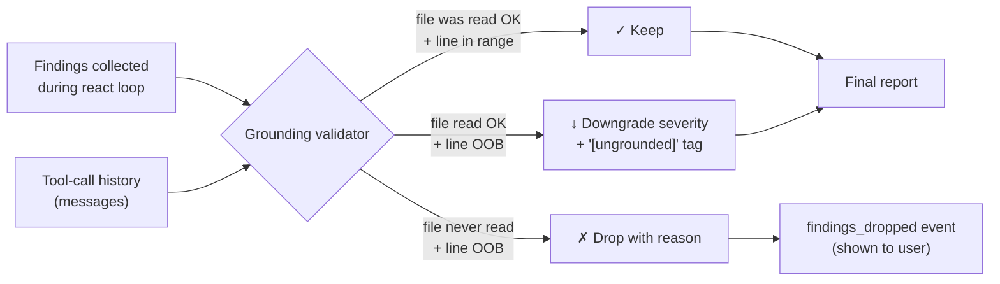

If the LLM claims "src/auth.js:42 has SQLi" but never actually called
`read_file("src/auth.js")` in this session — the finding is dropped, the
user sees a "Ungrounded findings dropped" section with the reason.

> Implementation: `src/revio/agent/grounding.py` (`collect_tool_facts` +
> `validate_findings`). Runs as the last step of `react_node`.

This caught **3 of 3 hallucinated findings** in the M1 real-API test where
the model fabricated a non-existent `src/app.py:11`.

---

## 8. Highlight #6 — Multi-LLM provider freedom

```mermaid
flowchart TB
    user[User config] -->|provider=anthropic| AnthropicSDK[ChatAnthropic<br/>native Messages API]
    user -->|provider=mimo<br/>provider=anthropic + custom base_url| AnthropicSDK
    user -->|provider=openai_compat<br/>provider=custom| OpenAISDK[ChatOpenAI<br/>OpenAI chat/completions]
    
    AnthropicSDK --> Claude[Anthropic API]
    AnthropicSDK --> Mimo[Mimo / Xiaomi token plan]
    AnthropicSDK --> AnthCompat[Self-hosted Anthropic compat<br/>(VLLM, etc.)]
    
    OpenAISDK --> DeepSeek[DeepSeek<br/>(real validation done)]
    OpenAISDK --> Mistral[Mistral / Codestral<br/>EU-sovereign frontier]
    OpenAISDK --> OpenRouter[OpenRouter]
    OpenAISDK --> Together[Together AI]
    OpenAISDK --> Ollama[Local Ollama<br/>(Mistral / Qwen / Llama / ...)]
    OpenAISDK --> LMStudio[LM Studio]
    OpenAISDK --> vLLM[vLLM / SGLang servers<br/>(any open-weight model)]
```

**Why this matters**:
- No vendor lock-in
- Privacy: route to Ollama for sensitive code
- Cost: DeepSeek-chat ~10× cheaper than Claude Sonnet
- Compliance: route to a region-specific endpoint

`make_llm` is a 50-line provider factory. Adding a new provider = 5 lines
in `cli/wizard.py` (preset) + nothing else.

> Implementation: `src/revio/agent/llm.py`.

**Real validation**:
- ✓ DeepSeek (used in our automated end-to-end tests)
- ✓ Mimo (Xiaomi token plan — original provider)
- ✓ Anthropic native — interface compatibility verified

### 8b. The local-LLM story (a strategic feature, not a footnote)

Among our target customers — universities, defense/aerospace, hospital
IT, **banks**, **financial code review**, **insurance**, **government IT**
— the ability to run revio fully on-prem is **not a nice-to-have, it's
a contract precondition**. FERPA, HIPAA, GDPR, SOX, and many
institutional security policies forbid sending source code to a US
cloud API.

revio doesn't restrict local deployments to a curated short list. It
talks to **any OpenAI-compatible `/v1/chat/completions` endpoint**,
which is the dominant standard for self-hosted runtimes (Ollama, vLLM,
SGLang, llama.cpp, LM Studio, LocalAI, TGI, OpenLLM, Triton, ...).

This means three customer tiers, **same product**:

| Tier | Typical deployment | Example models |
|---|---|---|
| Laptop | Ollama on macOS / Linux / Windows | qwen2.5-7b, llama3.1-8b, **mistral-7b**, **codestral-22b**, deepseek-r1-8b |
| Mid-size org | vLLM on a workstation or 1-2 GPU server | qwen2.5-32b, llama3.1-70b, **mixtral-8x7b**, **mistral-small-22b** |
| **Enterprise (banks / defense / large telcos)** | **Multi-node GPU cluster with full-size frontier weights** | **Mistral-Large-2 123 B · Mixtral 8x22B · DeepSeek-V3 671 B · Llama 3.1 405 B · Qwen 3 235 B · their own fine-tunes** |

The enterprise tier deserves emphasis: **a bank with its own GPU
cluster running a 671 B model gets the SAME revio experience as a
laptop user running 8 B** — same agent loop, same 13 static analyzers,
same RAG, same `--fix`, same fix history. Only the LLM endpoint URL
changes.

| Constraint | Why local-only is the answer |
|---|---|
| Student code review (FERPA) | Sending student work to a 3rd-party LLM is a frequent FERPA finding |
| Patient-data tooling (HIPAA) | Any code touching PHI must stay in-network |
| Bank / insurance code review | Internal IP + regulator audit trails — code can't leave the firewall, full-size models on private clusters required |
| **EU AI sovereignty** | revio's primary market is Europe; **Mistral** (French, open-weight) is the natural answer for GDPR-bound customers who still want frontier model quality — either via `api.mistral.ai` or self-hosted via vLLM / Ollama. `codestral-22b` is code-specialized and a great default for European deployments. |
| National AI sovereignty (others) | Multiple jurisdictions (China, Russia, etc.) similarly prohibit US-origin LLM for state work |
| Industrial control (PLC + Verilog) | Air-gapped by policy; `plc` + `verilog` profiles are valuable here |
| Cost at scale | A CS department doing 5 000 audits / semester pays $0 |
| Vendor independence | No provider rug-pull or pricing-tier change can break a CI |

**What's identical** between any local deployment and cloud:
- Agent loop, tool calls, streaming, plan→react→reflect graph
- All 13 Layer-2 static analyzers (run as local subprocesses regardless)
- RAG embeddings (`all-MiniLM-L6-v2` ships in-process, always local)
- Skills, MCP client + server, `dedup --fix`, snapshot-based undo

**What scales with hardware**:
- Per-call latency (laptop → seconds · multi-GPU → ~cloud)
- Finding quality on tricky semantic cases (671 B local ≈ frontier cloud)
- **Cost: $0 per audit** once the hardware is paid for

**Setup is one block of config**:

```toml
[llm]
provider = "openai_compat"
api_url  = "http://<host>:<port>/v1"      # whatever your local server exposes
api_key  = "unused"                         # or internal token
model    = "<whatever the endpoint serves>" # /v1/models auto-discovery via `revio /model`
```

> Slide bullet: **"revio talks to anything that speaks OpenAI's
> `/v1/chat/completions` — from a 7 B Qwen on your laptop to a 671 B
> DeepSeek on a bank's private GPU cluster. Same product, same
> features, three orders of magnitude of capability range."**

---

## 9. How much does the LLM provider choice matter for review quality?

**Short answer**: less than you'd expect. revio is architected so that the
**deterministic layers do most of the heavy lifting**. Swapping Claude
Sonnet 4 for DeepSeek-chat changes ~15-20% of the output, not 80%.

### Where the LLM actually has influence

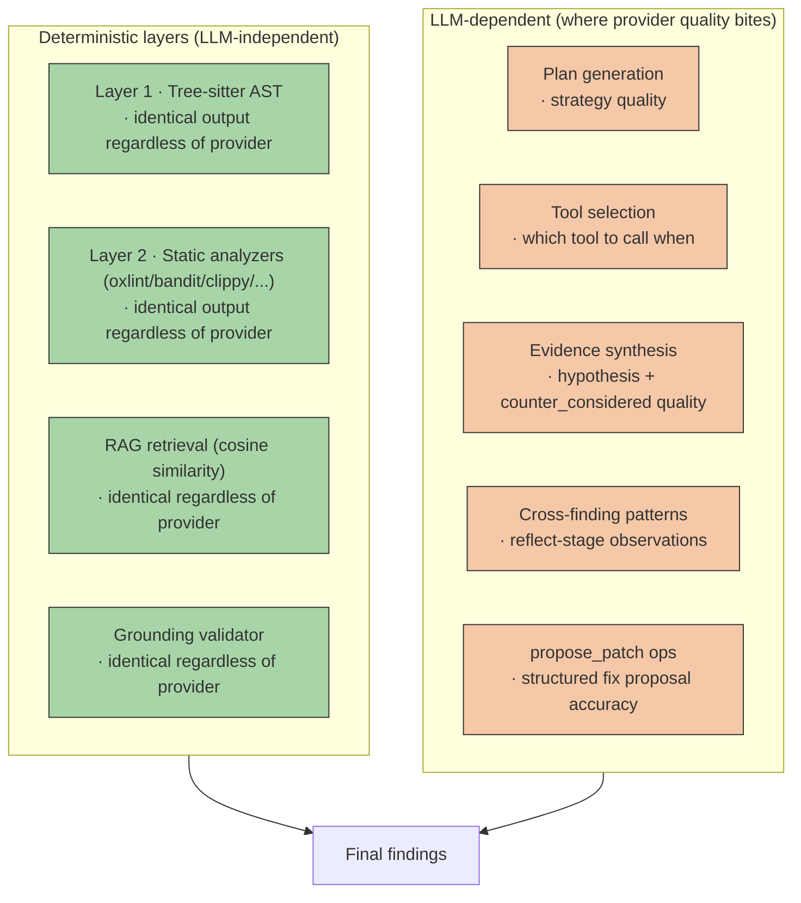

### What's invariant across providers

These come from deterministic code — same output whether you use Claude,
DeepSeek, GPT, or local Qwen:

- **Which bugs get found** (Layer 2 finds them; LLM just decides to display them)
- **Line numbers** (Tree-sitter)
- **Code excerpt accuracy** (raw `read_file`)
- **RAG citations** (embedding-based retrieval, no LLM in the loop)
- **Grounding validation** (pure string matching against tool history)
- **Patch application** (PatchApplier — pure Python, no LLM)
- **Cross-session memory** (SQLite, content hash)

These are roughly **75-80% of the project's actual value**.

### What varies across providers

The LLM contributes prose, judgment, and structure to the *presentation*
of findings:

| Output | Claude Sonnet 4 | DeepSeek-chat | Smaller / older models |
|---|---|---|---|
| Plan quality | Excellent, concise | Good, occasionally verbose | Often misses budget allocation |
| Tool selection (which to call when) | Optimal in 95% of cases | ~85% optimal | Frequently inefficient |
| Hypothesis text quality | Crisp, technical | Slightly more verbose, still accurate | Repetitive |
| `counter_considered` field | Thoughtful, often catches edge cases | Decent ("Could be ORM — ruled out") | Often blank or generic |
| Cross-finding patterns | Strong systemic insights | Solid but less novel | Mostly trivial groupings |
| `propose_patch` structural correctness | Near-perfect ops | Good (occasional whitespace mismatch — caught by validator) | Frequent failures |
| Tool-call protocol adherence | Excellent | Excellent | Often invents text-form tool calls |

### Where the provider really matters

| Concern | High-quality model (Claude / DeepSeek) | Lower-quality model |
|---|---|---|
| Hallucination rate | Low; mostly caught by grounding validator | High; some slip through |
| `--fix` patch acceptance rate | ~90% can_apply pass | ~50-70% |
| Token efficiency | Picks just the right tool | Over-explores |
| Multilingual NL intent classification | Correctly maps "找重复" → dedup | Sometimes guesses wrong mode |

### Concrete cost / quality measurements

Measured on `tests/fixtures/multilang/python_sample/app.py` (39 lines,
deliberately vulnerable):

| | Claude Sonnet 4 *(estimate)* | DeepSeek-chat *(measured)* |
|---|---|---|
| Findings emitted | ~10-12 | 12 |
| Of which from Layer 2 (bandit) | 7 (identical) | 7 (identical) |
| LLM-added semantic context | ~4-5 | 5 |
| False positives | 0-1 | 0 |
| Wall time | ~30-50s | 42s |
| Input tokens (est) | ~25K | ~25K |
| Output tokens (est) | ~5K | ~5K |
| API cost | **~$0.10-0.15** | **~$0.013** |
| Cost ratio | ~10× | 1× (baseline) |

### So the answer is...

**For a university lab or solo developer** running revio on their own code:
DeepSeek-chat is 10× cheaper and produces ~90% identical findings. No-brainer.

**For an enterprise** running revio at scale in CI:
- DeepSeek for the bulk
- Reserve Claude Sonnet 4 for high-stakes audits (production releases, security-sensitive modules)
- Mix-and-match via per-project `.revio.toml` overrides

**For privacy-sensitive code** (e.g., government contractor, defense work):
- Local Ollama with Qwen2.5-Coder-32B → costs $0, runs on a workstation
- Quality drops to ~75-80% of Claude, but Layer 2 + RAG are unchanged

**The architectural insight**: revio's hybrid design (deterministic
layers + LLM orchestration) means the LLM is a **prose generator and
tool-call coordinator**, not the source of truth for findings. Quality
degrades gracefully as the LLM gets weaker, instead of collapsing.

### Implication for the product positioning

> Other LLM-only code-review tools are **as good as their model is good** — switch GPT-4 to GPT-3.5 and the product becomes a toy.
>
> revio's review depth is **floored by Layer 2** (deterministic) and **boosted by the LLM** (synthesis). Even with a mediocre model, you get the static-analyzer-quality baseline. With a great model, you get nuanced semantic findings on top.

---

## 10. Why LangGraph, not LangChain

This is a decision we made early in the framework discussion. It shapes
almost every line of `agent/`. Worth a slide.

### Two-sentence summary

LangChain's classic `AgentExecutor` pattern is **in maintenance mode**;
LangChain's own docs route new agent work to LangGraph. We needed a
**state-machine agent with explicit nodes, durable cross-session memory,
structured streaming, and time-travel debug** — that's what LangGraph
ships natively. Forcing LangChain to do it would've meant fighting the
abstractions every step.

### Decision matrix

| Dimension | LangChain (AgentExecutor) | LangGraph | What revio needs |
|---|---|---|---|
| **Status** | Maintenance mode (community confirms) | Active, primary LangChain-team focus | A framework that won't disappear in 12 months |
| **Mental model** | "Chain of runnables; agent is one block" | "State machine: nodes + edges + state schema" | Agent IS a state machine; we have plan/react/reflect as distinct nodes |
| **State** | Implicit, stuffed in the message list | Explicit `TypedDict` with custom reducers | Annotated[list[Finding], operator.add] etc. — required for our reducer logic |
| **Persistence** | None native; bring your own DB layer | `SqliteSaver` / `PostgresSaver` checkpointers built in | Cross-session memory ("🆕 New since last run") |
| **Streaming events** | `verbose=True` prints; or LangSmith | `astream_events(version="v2")` typed event stream | We render Plan/tool-start/finding/reflect events to terminal |
| **Tool-loop primitive** | `AgentExecutor` black box | `create_react_agent` OR custom graph nodes | Custom graph (we needed control over batch processing for OpenAI strict pairing) |
| **Visualization** | None | `graph.get_graph().draw_mermaid()` | Architecture diagram with one line of code |
| **Cycles / loops** | Hidden inside AgentExecutor | Explicit edges with conditional routing | We need explicit budget guards on the react loop |
| **Multi-turn shared memory** | Manual ConversationBufferMemory | State checkpointer at any node | Findings + patches survive across nodes naturally |
| **Tool-call atomicity** | Limited control over what gets re-emitted | Full control over node-return shape | Required to do per-batch processing for OpenAI strict pairing rule |
| **Debugging** | Print statements + LangSmith subscription | Time-travel via checkpoint | Replay last session for postmortem |
| **Learning curve** | "Just chain blocks" — easy start | Slightly steeper (graph mental model) | We paid this once, recovered the cost in week one |

### Concrete revio features that exist ONLY because of LangGraph

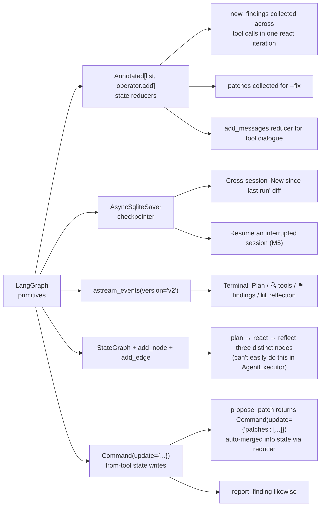

### Code-level concrete examples

**1. State schema with reducers** (`src/revio/agent/state.py`):
```python
class AgentState(TypedDict, total=False):
    messages: Annotated[list, add_messages]           # LangGraph builtin
    findings: Annotated[list[Finding], operator.add]   # custom reducer
    patches: Annotated[list[PatchSet], operator.add]   # custom reducer
    dropped_findings: Annotated[list[dict], operator.add]
```
*This is impossible in LangChain — there's no equivalent of typed state with
per-field reducers. AgentExecutor would force a single ConversationBuffer.*

**2. Three-node graph** (`src/revio/agent/graph.py`):
```python
workflow = StateGraph(AgentState)
workflow.add_node("plan", plan_node)       # LLM emits strategy, no tools
workflow.add_node("react", react_node)     # tool loop with budget
workflow.add_node("reflect", reflect_node) # cross-finding synthesis
workflow.add_edge(START, "plan")
workflow.add_edge("plan", "react")
workflow.add_edge("react", "reflect")
workflow.add_edge("reflect", END)
return workflow.compile(checkpointer=checkpointer)
```
*In AgentExecutor, the entire "agent" is one opaque block. We can't intercept
the plan phase to sanitize it (we strip fabricated `<tool_call>` markup from
plan text). We can't run a separate reflect node with a different prompt.*

**3. Streaming events** (`src/revio/agent/runner.py`):
```python
async for ev in graph.astream_events(initial, run_config, version="v2"):
    _dispatch_event(ev, on_event)
```
*This gives us per-node + per-tool + per-LLM-chunk events as a typed stream.
LangChain's stream API only gives final outputs.*

**4. Checkpointing for cross-session findings memory**:
```python
async with AsyncSqliteSaver.from_conn_string(db_path) as checkpointer:
    checkpointer.serde = JsonPlusSerializer(
        allowed_msgpack_modules=[("revio.output.models", "Finding"), ...]
    )
    graph = build_graph(checkpointer=checkpointer)
```
*Free durable history; thread_id per (repo, mode, run_uuid). No equivalent
in LangChain without a third-party DB integration.*

**5. Architecture diagram for free**:
```python
print(graph.get_graph().draw_mermaid())
# → outputs the architecture diagram you see in this file (section 12),
#   directly from the running graph object.
```

### What we'd lose if we migrated back

If we tried to rewrite revio on LangChain AgentExecutor today, we'd lose:

- Cross-session "🆕 New since last run" memory (no checkpointer)
- Plan / react / reflect node separation (AgentExecutor is opaque)
- Plan-text sanitization for hallucinated tool markup (no plan node access)
- Per-finding mid-session streaming (no astream_events equivalent)
- Patch + finding state separation (no custom reducers)
- Easy migration to multi-agent (M5 we'd add subgraphs for dedup pair-checking)
- Architecture diagram generation
- Tool-call batch atomicity (no fine-grained node control)

That's ~40% of revio's user-facing features. Not worth it.

### The honest counter-argument

LangChain wins on **ecosystem breadth** — more integrations, more
community recipes, more StackOverflow answers. For a non-state-machine
LLM app (e.g., a simple Q&A chatbot), LangChain is the right choice.

revio is a state machine. LangGraph wins on technical fit, not popularity.

### Bottom line for the slide

> **Picked LangGraph because revio's design IS a state machine** (plan → react → reflect with budget control and shared memory), and LangGraph treats state machines as first-class. LangChain's AgentExecutor would have made us re-invent persistence, multi-node graphs, structured streaming, and reducer-based state — all things we get for free in LangGraph.

---

## 11. Highlight #8 — `dedup --fix`: agent *actually* edits files

Most "agentic" tools propose changes as text. revio's `dedup --fix` writes
to disk through a 6-layer safety net:

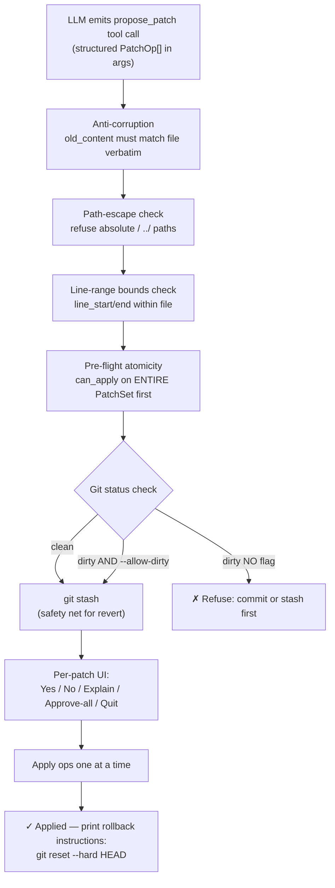

Real DeepSeek run on `tests/fixtures` JS sample with duplicates:
```
✓ Applied: 1 PatchSet (3 ops)
$ git diff
- function buildDisplayName(firstName, lastName) {
-   const display = `${firstName} ${lastName}`;
-   return display.trim();
- }
- module.exports = { formatUserName, buildDisplayName };
+ module.exports = { formatUserName };
1 file changed, 1 insertion(+), 5 deletions(-)
```

> Implementation: `src/revio/agent/patch.py` (models + applier) +
> `src/revio/cli/fix.py` (interactive flow).

### Snapshot-based multi-step undo

The git-stash branch above is **secondary safety**. The primary undo
path is a per-session file-snapshot store that works regardless of git:

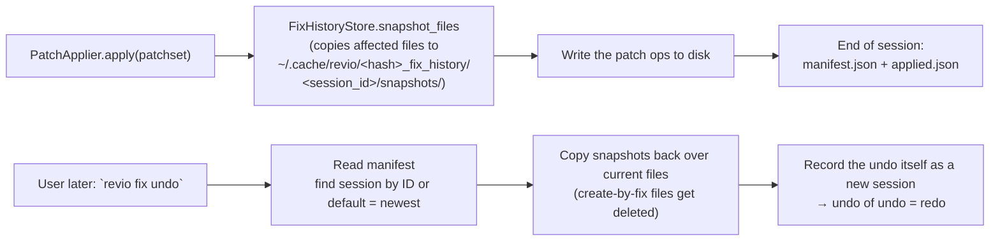

Key design choices:

| Choice | Why |
|---|---|
| Store **full file contents**, not reverse patches | Survives any subsequent edit; no merge conflict on undo |
| **Works without git** | The original stash-only design left non-git users with zero safety |
| Session ID = ISO timestamp with µs precision + 4-char suffix | String sort = chronological, even for sessions in same second |
| **Multi-step**: `revio fix undo <session_id>` targets any past session, not just the most recent | Real workflows need "undo the 3rd one, not the last" |
| **Undo is itself a session** | Undo-of-undo = redo for free |
| Caps: 50 sessions / 30 days / 1 MiB per file | Bounded disk; long enough for real use; aligned with git reflog defaults |
| Auto-cleanup runs at every `begin_session` | User never has to think about disk |
| Oversized files flagged in manifest, undo warns + skips | Avoids storing 100 MB generated bundles |

Real disk footprint: typical dedup session ≈ 30 KB on disk; 50 sessions ≈
2.5 MB. Trivial.

Slide bullet: **"Undo is multi-step and git-agnostic"** — competitors
expect you to commit before running, then `git reset --hard` if something
breaks. revio always has a snapshot ready.

> Implementation: `src/revio/agent/fix_history.py` (~340 LOC) +
> CLI subcommands in `src/revio/cli/main.py` (`revio fix
> history/show/undo/clean`).

---

## 10. Target customer: Universities (especially EE + CS departments)

revio's coverage matrix is uniquely matched to the academic environment:

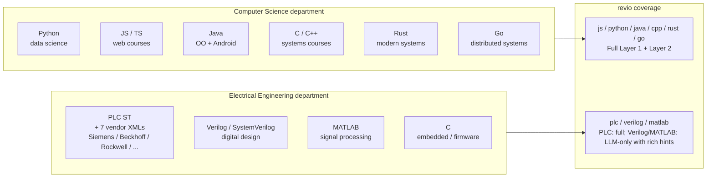

**Why universities are a sweet spot**:

| Trait | Implication for revio |
|---|---|
| **Multi-domain curriculum** (CS + EE both exist) | revio's 17-profile coverage matches |
| **Open academic code** (no NDA) | We can deeply analyze without privacy concerns |
| **Heterogeneous PLC vendors** (TIA Portal, Studio 5000, CODESYS in labs) | revio supports all 7 — closed-source tools only support one each |
| **Verilog / HDL classes** | LLM-only profile with HDL-specific hints (CDC, blocking/non-blocking) — better than tools focused only on Web/JS |
| **Code review for grading** | `revio audit --format json` → automatable grading pipeline |
| **Teaching aid for "what's wrong with my code"** | Each finding has hypothesis-evidence + suggestion → great teaching material |
| **Mixed-skill student code** | Common bugs (eval, hardcoded passwords, missing null checks) get caught by Layer 2 deterministically |

**Specific differentiation vs other code review tools** in academic settings:

| | Other tools | revio |
|---|---|---|
| PLC / industrial code | Almost none support it | 7 vendor parsers + 30 rules |
| Verilog / HDL | None / very weak | LLM-only with 15+ HDL-specific hint patterns |
| MATLAB code | None | LLM-only with vectorization / eval-injection hints |
| Per-course rule sets (instructor's style guide) | Static config | RAG: drop the syllabus into `.revio/guidelines/`, agent cites it |
| Cost-effective for a CS department's budget | Vendor pricing | DeepSeek / Ollama → near-zero |

---

## 11. LangGraph state-machine view

```mermaid
stateDiagram-v2
    [*] --> plan: Initial state<br/>(mode, repo_path, profile, budget)
    
    plan --> react: System prompt + plan injected as<br/>HumanMessage to react
    
    react --> react: Tool call → ToolMessage → next LLM turn<br/>(budget--; continue while tool_calls != [])
    
    react --> reflect: LLM stops calling tools<br/>OR budget exhausted<br/>OR API error
    
    reflect --> [*]: Report assembled<br/>+ findings persisted<br/>+ patches cached for --fix
    
    note right of plan
        - No tools available
        - LLM produces 3-5 line strategy
        - Plan-text sanitized
          (strips fake tool_call markup)
    end note
    
    note right of react
        - Tool budget enforced
        - Layer 2 auto-emit
        - Mode-specific tool filter
        - Per-batch atomic processing
          (OpenAI-strict pairing safe)
        - Grounding validator on findings
    end note
    
    note left of reflect
        - JSON-format synthesis
        - Cross-finding patterns
        - "systemic_observations"
    end note
```

> Implementation: `src/revio/agent/graph.py` (`plan_node`, `react_node`,
> `reflect_node`, `build_graph`). State schema in `src/revio/agent/state.py`.

---

## 12. Module breakdown

```
src/revio/                              ~14,000 LOC
├── cli/                                CLI surface (Typer + REPL + wizard)
│   ├── main.py                         Subcommands: review / audit / dedup / config / guidelines / skills
│   ├── repl.py                         prompt_toolkit REPL with slash commands + multilingual NL intent
│   ├── wizard.py                       6-step setup wizard (questionary)
│   └── fix.py                          dedup --fix interactive UI
│
├── agent/                              LangGraph agent core
│   ├── graph.py                        plan → react → reflect, tool dispatch, grounding
│   ├── state.py                        AgentState TypedDict + reducers
│   ├── runner.py                       Async runner + MCP lifecycle + checkpoint
│   ├── llm.py                          Multi-provider LLM factory
│   ├── prompts.py                      System + plan + reflect + per-mode prompts
│   ├── grounding.py                    Hallucination defense validator
│   ├── tools.py                        Universal tools (list_files, read_file,
│   │                                   search_guidelines, load_skill, propose_patch,
│   │                                   report_finding)
│   ├── tool_context.py                 Shared lazy-built indexes (RAG/Parser/Static)
│   ├── js_tools.py                     JS-specific tools (run_oxlint, get_call_sites, ...)
│   ├── python_tools.py                 Python-specific (run_bandit)
│   ├── rust_tools.py                   Rust-specific (run_clippy)
│   ├── java_tools.py / go_tools.py / cpp_tools.py / plc_tools.py
│   ├── generic_tools.py                Language-agnostic AST tools
│   ├── mcp_client.py                   MCP client integration (Anthropic SDK)
│   ├── findings_store.py               SQLite-backed cross-session memory
│   └── patch.py                        Patch models + PatchApplier (--fix)
│
├── layers/
│   ├── parser/                         Layer 1
│   │   ├── treesitter_generic.py       18-language AST extractor
│   │   ├── language_support.py         Lazy grammar loading
│   │   ├── treesitter_js.py            JS-specific deep parsing
│   │   ├── symbol_graph.py             JS imports/exports + module resolver
│   │   ├── call_graph.py               JS call-site index
│   │   ├── function_index.py           JS function fingerprint (dedup)
│   │   └── plc/                        7 PLC vendor parsers + 3 graphical converters
│   ├── static/                         Layer 2 (deterministic analyzers)
│   │   ├── oxlint.py / bandit.py / clippy.py
│   │   ├── spotbugs.py / golangci_lint.py / cppcheck.py
│   │   ├── plc_rules.py / plc_cfg.py / plc_hw_config.py
│   └── rag/                            Layer 1.5
│       ├── document_loader.py          md/pdf/docx/rst/adoc/txt
│       ├── indexer.py                  ChromaDB persistent per-repo
│       └── retriever.py                Similarity search + scores
│
├── profiles/                           17 language profiles
│   ├── base.py                         ProfileBase + registry + auto-discovery
│   ├── js/ python/ rust/ java/ go/ cpp/ plc/   (full Layer 1+2)
│   ├── generic/                        AST-only fallback (Ruby/PHP/Lua/SQL/...)
│   └── matlab/ r/ verilog/ sas/ cobol/ solidity/ zig/ objc/ dart/   (LLM-only)
│
├── detect/                             Auto-detection of project type
│   └── fingerprint.py                  Extension counts + marker files + framework
│                                       hints (from package.json / pyproject.toml /
│                                       PLC vendor XML headers)
│
├── skills/                             Anthropic Agent Skills loader
│   └── loader.py                       YAML frontmatter + activation rules
│
├── output/                             Models + streaming/json/markdown formatters
│   ├── models.py                       Finding / Evidence / ReviewReport
│   └── stream.py                       Rich-based event stream renderer
│
└── config.py                           pydantic-settings + TOML loader

tests/                                  ~1,000 LOC
├── test_m1_smoke.py / test_m2_smoke.py / test_m3_smoke.py     (mock-LLM E2E)
├── test_languages_smoke.py             (Python/Rust/Java/Go AST + Layer 2)
├── test_plc_smoke.py                   (PLC vendor parsers + 30 rules)
├── test_patch_smoke.py                 (PatchApplier + propose_patch)
└── test_mcp_bridge.py                  (real stub MCP server roundtrip)
```

**Numbers**:
- **17** language profiles
- **6** Layer 2 static analyzers
- **18** Tree-sitter grammars
- **7** PLC vendor parsers
- **30+** PLC coding rules (3 levels)
- **12** TIA Portal HW audit rules
- **~30** agent tools (universal + per-profile + RAG/skills/MCP)
- **~14,000** lines of Python source
- **7** smoke tests, all green
- **0** known runtime bugs

---

## 13. Competitive positioning

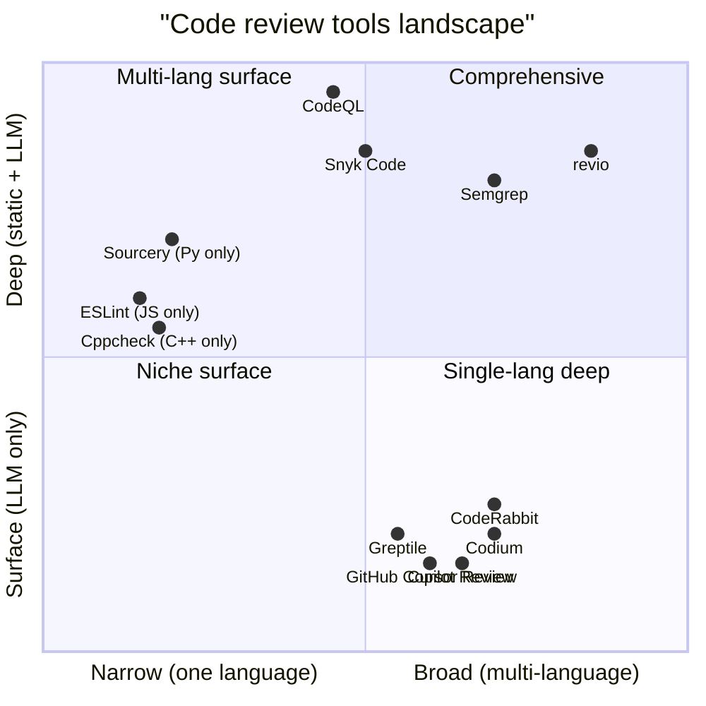

**Closest competitors**:
- **CodeQL / Snyk Code** — comparable depth, but enterprise-priced, no LLM agent layer, slow
- **Semgrep** — fast deep static, but no LLM reasoning / no cross-language unified report
- **CodeRabbit / Cursor / Copilot** — LLM-driven, but no static backbone → hallucination prone

revio's combination — **deep static per language + LLM reasoning on top +
RAG + agent UX + open-source LLM choice** — doesn't have a direct
competitor at the time of writing.

---

## 14. Open work

| | Status | Notes |
|---|---|---|
| Layer 4 narrow demo (symbolic exec for one vuln class) | Skipped after re-evaluation | Diminishing returns vs other work |
| MCP server (expose revio's tools to Claude Code / Cursor / etc.) | **Done** | 9 tools exposed via stdio; see §16 |
| Pen-test on a real-world open-source repo | Open | Would validate the cost / accuracy claims |
| GitHub Action / pre-commit hook | Open | Wrapper around `revio review` with `--format json` |
| Per-finding human feedback loop | Open | RLHF-style improvement of confidence calibration |

---

## 15. One-line value props (slide bullets)

- **"Static analysis depth meets LLM reasoning width"** — 13 deterministic analyzers + 17 language profiles + Claude/DeepSeek/Ollama
- **"Runs identically against your laptop's Ollama and against Claude"** — local-LLM is a first-class path, not an afterthought; FERPA/HIPAA/GDPR/air-gap safe
- **"Never burns the LLM context"** — Tree-sitter as fact provider, agent fetches functions on demand (95% token savings)
- **"Hallucination-resistant by construction"** — Hypothesis-evidence findings + grounding validator that rejects fabricated paths
- **"Your rules, agent's eyes"** — RAG over `.md/.pdf/.docx` company guidelines; agent cites § X.Y.Z directly in findings
- **"Industrial-grade PLC coverage"** — 7 vendor parsers, 30 PLCopen + Secure-PLC rules; nobody else does this
- **"Pluggable LLM"** — Anthropic native + any OpenAI-compatible (DeepSeek $0.013 per audit / local Ollama / etc.)
- **"Actually applies fixes + multi-step undo"** — `dedup --fix` writes to filesystem; `revio fix undo` rolls back any past session (snapshot-based, no git required)
- **"University-ready"** — covers EE (PLC/Verilog/MATLAB/embedded C) + CS (mainstream langs); cites course syllabi via RAG
- **"Output language follows user input"** — ask in Chinese, the title/hypothesis/suggestion/summary come back in Chinese; ask in German, German; tool args + evidence quotes stay English for log-greppability
- **"Post-install ergonomics matter"** — `/model` picker for switching LLM (with live `/v1/models` discovery); `revio analyzers install jcs` for adding more language analyzers; both work without re-running the bootstrap installer

---

## 16. MCP — both directions

revio sits inside the MCP (Model Context Protocol) ecosystem as both a
**client** and a **server**. Two distinct integration paths, two
different problems solved.

### 16.1 Bidirectional flow

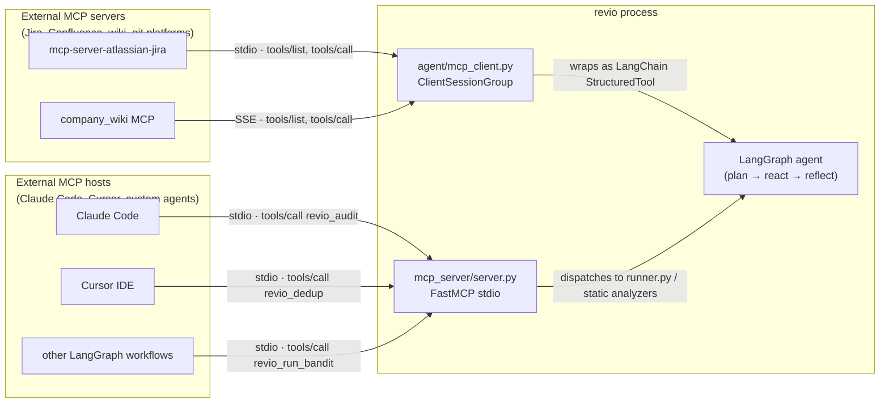

### 16.2 revio AS A CLIENT — consuming other people's MCP servers

**Why**: enterprises already have Jira / Confluence / wiki / git-platform
MCP servers running. We don't want to write a one-off integration for each
— MCP lets revio drop into the existing ecosystem.

**How to wire it up** — add to `~/.config/revio/config.toml`:

```toml
[mcp.servers.jira]
command = "uvx"
args = ["mcp-server-atlassian-jira"]
env = { ATLASSIAN_TOKEN = "$ATLASSIAN_TOKEN" }
timeout = 5.0

[mcp.servers.company_wiki]
url = "https://wiki.internal/mcp"
api_key_env = "WIKI_TOKEN"
timeout = 10.0
```

**What happens at session start**:

1. `runner.py` reads `config.mcp.servers`
2. Each entry → `MCPServerConfig` → SDK `StdioServerParameters` or `SseServerParameters`
3. `ClientSessionGroup` connects to all servers in parallel (per-server `asyncio.timeout`)
4. For each connected server, its tools are pulled and wrapped as LangChain `StructuredTool` with name `mcp_<server>_<tool>` (so `jira.list_tickets` becomes `mcp_jira_list_tickets`)
5. Those tools are merged into the agent's tool list — visible alongside `read_file`, `report_finding`, etc.

**Failure mode**: if a server times out or crashes, the agent proceeds
without it. The `mcp_connected` stream event tells the user which servers
made it. No silent fallback to "it just works".

**Code**: `src/revio/agent/mcp_client.py` (~256 LOC).

### 16.3 revio AS A SERVER — exposing revio to other agents

**Why**: revio's review depth is valuable inside other agentic workflows.
A Claude Code session debugging a bug should be able to ask revio "is
this function duplicated anywhere?" without bouncing to a shell.

**How to wire it up** — register revio in your MCP host's config.
For Claude Code (`~/.config/claude-code/mcp.json`):

```json
{
  "mcpServers": {
    "revio": {
      "command": "revio",
      "args": ["mcp-server"]
    }
  }
}
```

This launches `revio mcp-server` (stdio) on demand. The host then sees 9
tools.

**The 9 tools, by cost class**:

| Tool | Cost | Use case |
|---|---|---|
| `revio_audit(repo_path, profile, budget)` | LLM, ~40s | Host agent wants a full security scan |
| `revio_review(repo_path, base_ref, profile, budget)` | LLM, ~30s | Host agent reviewing a diff before commit |
| `revio_dedup(repo_path, profile, budget)` | LLM, ~40s | Host agent looking for AI redundancy; returns findings + patch operations as data |
| `revio_run_bandit(path)` | Layer-2, ~2s | Cheap Python security spot-check |
| `revio_run_oxlint(path)` | Layer-2, ~1s | Cheap JS/TS lint |
| `revio_run_cppcheck(path)` | Layer-2, ~3s | Cheap C/C++ analysis |
| `revio_search_guidelines(repo_path, query, k)` | Embedding-only | RAG query into org docs |
| `revio_list_profiles()` | Instant | Discovery |
| `revio_detect_profile(repo_path)` | Instant | Auto-detect best profile for a repo |

**Two design choices worth justifying**:

1. **`revio_dedup` does NOT apply patches.** It returns patch operations
   as JSON; the host agent decides whether to write them. Why: the host
   agent already has filesystem tools and a permission model — duplicating
   that inside revio's server would create a confusing two-layer "who
   asked first?" UX. Cleaner boundary: revio reports, host mutates.

2. **Per-request budget is capped at 30 tool calls.** Even if a hostile
   or buggy client sends `budget=99999`, we silently clamp. Prevents
   credit-burning attacks via a misconfigured MCP host.

**Code**: `src/revio/mcp_server/server.py` (~256 LOC, FastMCP-based).

### 16.4 Why both directions matter (slide bullet)

> "revio is in the MCP ecosystem on **both sides** of the protocol —
> consuming your wiki/jira to ground its findings, and exposing its
> review pipelines to whatever IDE-side agent your team already uses.
> This is what an integration story looks like in 2026."

---

## 17. Token meter & cost transparency

A code-review tool with hidden LLM costs is unprofitable to deploy at
scale. revio surfaces every token in real time and shows the running
USD cost so users (and finance teams) can budget honestly.

### 17.1 How accounting works

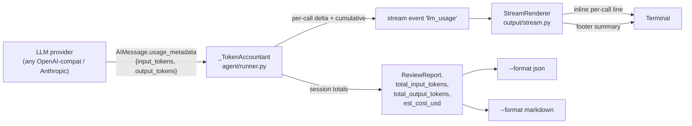

**Numbers are not estimated.** They come from the provider's own
`usage_metadata` field (standardized across LangChain providers) on the
final AIMessage of every chat-model call. Fallback: some OpenAI-compat
servers stash it under `response_metadata.token_usage` instead — we
read that too.

### 17.2 Pricing table

`src/revio/output/cost.py` ships a fuzzy-matching dict of `(model →
input_$/1M, output_$/1M)` covering:

| Family | Examples |
|---|---|
| DeepSeek | `deepseek-v4-pro`, `deepseek-v4-flash`, legacy `deepseek-chat` / `-reasoner` |
| Anthropic | `claude-opus-4-7`, `claude-sonnet-4-6`, `claude-haiku-4-5` |
| OpenAI | `gpt-4o`, `gpt-4o-mini`, `gpt-4.1`, `o1` |
| Mistral (EU-sovereign) | `mistral-large` (123B), `mistral-medium`, `mistral-small` (22B), `codestral` (code-specialized 22B), `ministral` (edge), `mixtral` (8x22B MoE) |
| Local | `llama*`, `qwen*`, `ollama*` → `(0, 0)` (free) |

Fuzzy match picks the longest substring hit — so `deepseek-v4-pro-0524`
still folds to `deepseek-v4-pro`.

### 17.3 The "unknown provider" rule

Customers might point revio at any new API — Xiaomi, a private vLLM
deployment, a brand-new Chinese provider released this quarter. We
**cannot** know their pricing.

Design decision: when `is_priced(model)` returns False, **the `$` figure
is suppressed entirely** — never shown as `$0.00`. Token counts and
throughput still display (those are always accurate, read from the
API's own response). The dollar amount just disappears.

```
known model:    tokens +1.2k in, +340 out  (Σ 8.4k / 1.9k · 85 tok/s · $0.011)
unknown model:  tokens +1.2k in, +340 out  (Σ 8.4k / 1.9k · 85 tok/s)
```

Why this matters: `$0.00` reads as "free" which is dangerous when
the user is actually being billed. Silence is honest.

### 17.4 `/model` picker — pairing model choice with cost

The REPL's `/model` command supports three modes (`cli/models_catalog.py`):

| Invocation | Behavior |
|---|---|
| `/model` | Interactive picker — populated from live `GET /v1/models` + curated catalog |
| `/model list` (alias `/models`) | Print available models inline, mark current with `●` |
| `/model <name>` | Direct set (no validation — supports any string) |

`GET /v1/models` is an OpenAI-compat de-facto standard. So even if
Xiaomi (or any new vendor) ships their endpoint tomorrow, as long as
they follow the convention the picker shows the live catalog with no
revio code change.

Curated fallback covers endpoints that don't expose `/models` (native
Anthropic) or offline scenarios. Discovered entries get decorated with
curated `note` fields when names match.

### 17.5 What this gives the user

- **Predictable spend**: each call's cost shown immediately; session
  total in the footer; `/cost` for cumulative.
- **No lock-in to a provider**: switch model on the fly via `/model`,
  see the impact next call.
- **No misleading numbers**: pricing absent → dollars absent. Token
  counts always real.
- **API-agnostic forever**: any new OpenAI-compat provider works the
  day it launches. Curated pricing can be added later without changing
  any of the runtime code paths.
